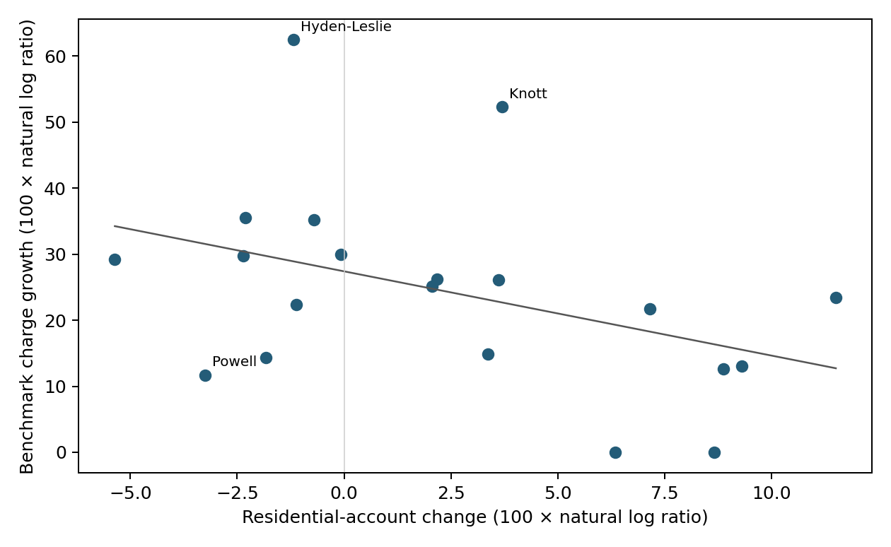
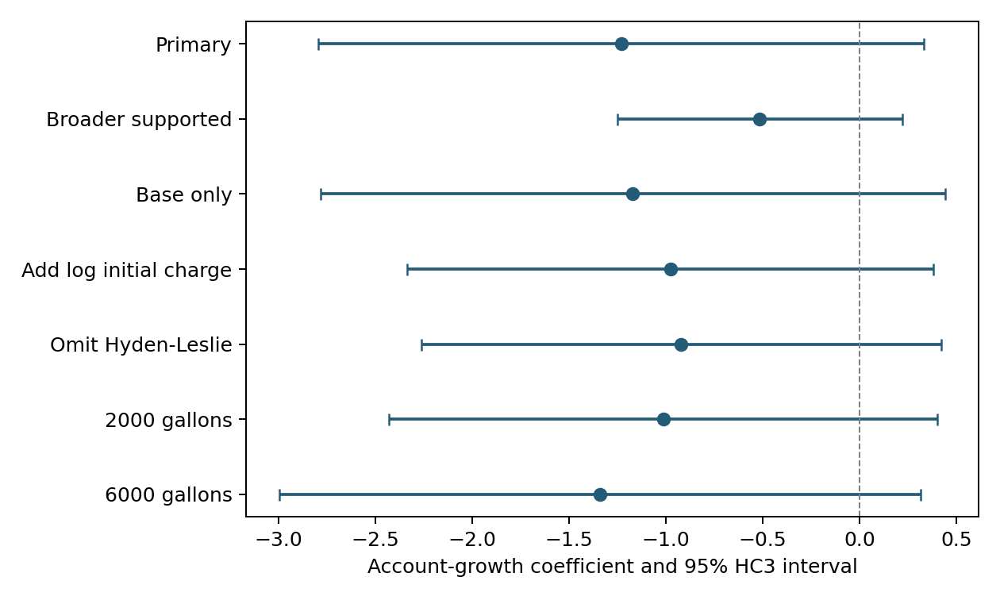

# Customer Base Change and Approved Water Charges in Kentucky 2019 to 2024

MD. Mushfiquzzaman Mahim | Berea College

October 2, 2026 | Revised working paper

## Abstract

How does water-price adjustment differ between utilities losing and gaining customers? This paper links Kentucky Public Service Commission residential-account records, historical tariffs, and regulatory documents for 2019–2024. The primary sample contains 20 districts passing a conservative account-continuity screen, including nine with declining accounts. The outcome is the approved charge for a designated ordinary small connection at fixed consumption, paired with district-wide residential-account change. At 4,000 gallons monthly, median nominal benchmark growth is 34.69% among declining districts and 24.24% among growing districts. A long-difference regression controlling for initial account-base size estimates an account-growth coefficient of −1.231 (95% HC3 interval [−2.794, 0.332]). The association is imprecise and noncausal. A source-linked ledger distinguishes schedule authorizations, amendments, and recurring charges from implemented billing periods. It documents intervening decreases, a surcharge absent at both endpoints, and retrospective corrections. The paper contributes a documented comparison of account change and approved charges, with a reconstruction of the regulatory paths behind the endpoints. The results describe selected districts, not causal effects or household expenditure.

Keywords: water districts; utility pricing; Kentucky; residential accounts; regulatory records.

## 1. Introduction

When customers leave a water system, the remaining customers may still have to support much of the same distribution network. A smaller customer base can therefore put upward pressure on charges. Infrastructure investment, purchased-water costs, financing, consumption patterns, and the timing of regulatory decisions can change prices independently of account losses. Prices may also influence customers’ decisions, and changes in reported accounts can reflect classification or service-territory changes rather than household departure.

This paper asks two linked questions. First, how is residential-account change associated with growth in a standardized approved water-service charge in Kentucky water districts between 2019 and 2024? Second, what documented rate adjustments account arithmetically for those price changes? The first question is addressed with a district-level long-difference analysis. The second is addressed with a source-linked reconstruction of regulatory events in the same districts. The records are also used to distinguish an approved year-end charge from the bills customers may have received during the intervening years.

The analysis begins with 97 matched district-name candidates in public annual reports. Historical tariff review selects all 17 initially declining districts and 17 randomly sampled nondeclining districts. After price and account-continuity review, the primary sample contains 20 districts. Deliberate oversampling of decline and subsequent complete-record exclusions mean that the analysis does not estimate statewide price-growth prevalence. It studies districts for which the defined historical comparison is supported.

The outcome holds monthly consumption constant at 4,000 gallons and includes base rates and supported recurring water charges. It excludes sewer, taxes, and nonrecurring fees. The resulting measure is a standardized pre-tax approved water-service charge at December 31 of each endpoint year. It measures neither an observed household invoice nor annual expenditure. Residential accounts are the predictor; they are not a substitute for population. Keeping these measures separate is necessary to interpret the estimated relationship.

The primary coefficient is −1.231, with a 95% interval spanning −2.794 to 0.332. The broader supported-price sample produces a smaller negative estimate. These findings do not establish a precise magnitude, a causal mechanism, or a statewide effect. The regulatory evidence contributes separately by showing heterogeneous paths to higher endpoint charges and identifying errors that a tariff-snapshot comparison can make.

The main contribution is the linkage of account records to historical tariffs and documented regulatory decisions. It supplies comparable charges, explains each selected district’s inclusion or exclusion, and shows how base-rate changes and recurring charges contribute to the endpoint differences. The documentary results have value even though the regression cannot identify the cause of those differences.

## 2. Related literature and economic framework

### 2.1 Shrinking systems, prices, and institutional decisions

Shrinking-system research identifies revenue loss and excess capacity as challenges for water utilities. Doyle et al. (2020) connect these pressures to affordability and service quality. In a close predecessor, Bash et al. (2020) examine financial sustainability in 16 Pennsylvania systems, with detailed cases in Altoona, Chester, Johnstown, and Reading. The report’s institutional abstract describes financial and credit indicators alongside rates, affordability, borrowing, and violations. Mahmood and Lane’s (2026) review emphasizes regionalization and regulatory or managerial responses. Ormsbee et al. (2026) describe infrastructure, financial, workforce, and governance challenges across interactions with 145 small Central Appalachian utilities. Together, this literature motivates examining account loss within a broader setting of financial and institutional adjustment.

Kentucky already has detailed work on tariff charges and affordability. Shelton, Draper, and Cromer (2023, pp. 5–7, 11–15, 29–30) calculate 2,000-, 4,000-, and 6,000-gallon charges for 233 providers using rates collected in late 2021 and early 2022. They include systemwide surcharges, examine income burdens, and discuss selected rate cases and ratemaking procedures. Patterson and Doyle (2021) distinguish household ability to pay from utility financial capability. Cardoso and Wichman (2022) and Patterson, Bryson, and Doyle (2023) show the importance of income distributions and service-area information for assessing household burdens. This literature supports fixed-consumption price comparisons while requiring income and service-area information for affordability claims. The present data contain neither household incomes nor a verified allocation of accounts to income groups.

Rate decisions themselves depend on utility and customer conditions. Allaire and Dinar (2022) examine pricing-method adoption in 323 California systems, while August et al. (2023) study financial capability and operating cost recovery among 301 North Carolina providers. These findings place account growth within a larger set of potential determinants, including costs, institutional capacity, and community conditions. They also caution against interpreting observed rates as exogenous to utility circumstances.

The present study follows selected districts from 2019 to 2024, linking account changes to dated tariff versions and a common reconstruction for all 20 primary observations. Standardized Kentucky charges and rate-case interpretation are established approaches; the contribution here is their longitudinal linkage, explicit account-continuity screening, and separation of endpoint approval from within-period billing. The Pennsylvania comparison remains provisional because its full report was not accessible. The supplement records the targeted literature review’s coverage; it does not establish priority over all earlier studies.

### 2.2 A limited economic benchmark

Consider a utility with an unchanged annual revenue requirement R and N identical accounts. Average required revenue per account is R/N. If account numbers fall by a fraction d while R remains constant, the proportional increase needed from the remaining accounts is d/(1−d). This illustrates the direction of cost-spreading pressure under fixed revenue needs. Actual tariff decisions are more complicated: residential accounts are not identical, other customer classes contribute revenue, use can change, and grants or borrowing can alter current revenue needs.

In the main sample, the largest account decline is approximately 5.22%. Under the illustration’s restrictive assumptions, maintaining the same revenue would require about 5.51% more per remaining account. Several observed charge increases are much larger. This does not rule out customer-loss pressure, because actual costs and demand changed. It does show that a constant-revenue account-spreading story is incomplete. The regression tests a descriptive association motivated by this pressure; its coefficient does not measure the engineering fixed-cost share.

A standardized charge can change through a minimum or meter charge, usage-block prices, or recurring extras. Some minimum charges include an allowance of water. Their share of a benchmark bill is consequently not the same as the share of system costs that is fixed. A purchased-water adjustment can increase or decrease the embedded base rate. A temporary surcharge can begin and end between the chosen endpoints. These features motivate reconstructing the price function and its documentary history instead of counting tariff sheets or comparing headline percentage increases in rate applications.

## 3. Data and price reconstruction

### 3.1 Kentucky regulatory setting

The study concerns PSC-regulated water districts. Kentucky providers do not all face identical oversight: municipal retail service is generally outside PSC regulation, although municipal wholesale sales to jurisdictional utilities may be regulated (Kentucky PSC, n.d.-a, n.d.-b). For these districts, a retail rate review evaluates the revenue requirement and the schedule needed to meet it. The alternative-rate procedure offers a simplified route for smaller utilities; the Corinth and Knott orders illustrate review of adjusted test-year operations rather than automatic acceptance of requested increases (Kentucky PSC, 2021-00425, pp. 1–2; 2019-00268, pp. 33–35).

Other routes address narrower decisions. A purchased-water adjustment passes through changes in wholesale water costs already embedded in retail rates, and can decrease as well as increase charges (Kentucky PSC, n.d.-b). Financing-linked approvals can join construction, borrowing, and prescribed rates: Hardin’s 2022 order implements a Rural Development agreement under a different review framework from an ordinary retail rate case. Separately authorized water-loss surcharges add recurring charges subject to their own terms, as Hyden and Mountain illustrate (Kentucky PSC, 2022-00337, pp. 1–2; 2020-00141; 2022-00366). These proceeding types identify regulatory routes, not isolated economic causes.

Orders may phase approved rates, as in Knott, or subsequently amend dates and amounts. The document date identifies when an order or sheet was issued; the service-effective date identifies the service to which its schedule applies. First billing and collections require separate evidence and can occur later. The outcome therefore reconstructs the approved charge at a specified endpoint. This distinction helps explain how Henderson can have intervening decreases, Muhlenberg can have a superseded approval, and Mountain can have a valid endpoint despite unresolved intermediate billing.

### 3.2 Administrative records and the study unit

The analysis uses Kentucky Public Service Commission annual-report records for residential accounts, historical tariff documents, and relevant commission cases. Endpoint annual-report data cover 2019 and 2024; intervening reports support continuity checks. Documents retrieved in 2026 are used to reconstruct historical schedules according to their effective dates. A document’s retrieval date is not treated as its price date. Later orders are retained when they clarify historical applicability or cessation, with the resulting information-vintage distinction made explicit.

The unit of observation in the regression is a district. Three standardized consumption scenarios do not create three independent observations per district. Similarly, multiple regulatory events do not increase the number of independent districts available for the main association. The analysis links records using utility identifiers and district names, but it does not equate an unchanged identifier with an unchanged economic service territory.

The initial frame consists of matched district-name candidates with positive endpoint residential counts. A documented Daviess consolidation effective January 1, 2021 is excluded from the stable-comparison frame. The remaining 96 candidates are still provisional institutional matches, not a verified census of unchanged legal entities and service boundaries. Public-report reconciliation supports arithmetic consistency, but it cannot certify that the reported classifications describe the same underlying customers in every year.

### 3.3 Selection and continuity screening

The historical tariff review selects 34 districts: all 17 initial decliners and a random sample of 17 from the original 80 nondecliners, using seed 20260920. Selection occurred on account changes before the reconstructed price outcome was inspected. Daviess was not among the selected 34, so the separate merger exclusion does not change the tariff draw. Subsequent evidence screens nevertheless introduce additional selection. Table 1 traces the stages rather than implying that all 97 candidates supplied usable historical prices.

Table 1. Sample construction

|Stage|Districts|Initial decliners|
|---|---|---|
|Original matched-name candidates|97|17|
|Historical tariff draw: all initial decliners + 17 sampled nondecliners|34|17|
|Reconstructed price pairs, including conditional cases|32|16|
|Supported benchmark price pairs|27|14|
|Primary: supported prices and account screen|20|9|

Daviess merger exclusion is a separate frame correction (97 to 96); Daviess was not in the 34-district draw. Initial classifications preceded tariff review. The primary sample is selected, not a representative statewide panel.

Supplement Table S1 gives the complete disposition of the 34 selected districts: 32 reconstructed pairs, 27 supported pairs, and 20 primary observations. Retention is 58.8% overall, 9/17 among initial decliners and 11/17 among sampled nondecliners. These different retention rates do not establish the direction of selection bias.

The conservative customer screen requires all six annual observations, unchanged reported endpoint county sets, no documented in-window merger, and no material continuity flag. A material flag is an absolute annual end-account change greater than 10%, or a beginning-year versus previous-year-end discrepancy exceeding 1% of the previous year-end count. These are quality-screening rules, not a claim that larger changes are impossible. A separate review file lists smaller start/end discrepancies exceeding one account; that broader review flag is not the material exclusion rule.

Reported category shifts demonstrate why screening matters. Barkley’s 2021 report places 91 accounts in residential service alongside 5,503 unmetered accounts. Caldwell’s 2022 figures similarly report 12 residential and 2,121 unmetered accounts. Such values may reflect classification changes rather than the underlying disappearance of almost all households. The analysis does not repair these observations by interpolation or by reallocating other categories to residential accounts. Their economic meaning requires additional verification.

Targeted follow-up does not resolve seven account exclusions. Trimble’s 2022 residential decline coexists with rising commercial and total metered counts; a category change is plausible, but its crosswalk is unavailable. Barkley and Caldwell have unresolved residential/unmetered classifications. North Hopkins has a temporary count surge despite matching annual starts. Webster has a 100-account opening discrepancy. Henry #2 lacks an accessible 2023 account record. East Pendleton’s financial discussion of new customers does not reconcile its much larger residential-count increase. These are distinct limitations, not seven proven economic contractions or seven confirmed errors. The source-supported district memo specifies what would permit reconsideration. No count is interpolated or reassigned.

County sets are also imperfect evidence. A reported change can be a reporting correction rather than a real territory change; a constant county set can hide a within-county transfer. The screen reduces observable comparability concerns without proving stable boundaries. Requiring complete reports and supported prices may select better-documented utilities, while the 10% threshold may remove genuine rapid change. The estimated relationship therefore applies to the selected sample. Table 1 documents retention, and the broader-sample sensitivity shows how the estimate changes when the account screen is relaxed.

### 3.4 The standardized charge

For a single ordinary retail connection using the smallest explicitly differentiated meter or the general monthly schedule, the reconstruction applies the schedule in force at December 31, 2019 and December 31, 2024. It calculates minimum or meter charges, included gallons, applicable usage blocks, and supported recurring water charges at 2,000, 4,000, and 6,000 gallons. The primary benchmark is 4,000 gallons. It is an analytical comparison point, not an estimate of each household’s consumption or a classification of household income.

The source-verification register covers 40 endpoints with literal meter labels, retail categories, geography, component dates, and calculated charges. Some schedules do not name a meter size. Hardin has a distinct 5/8-inch meter charge, and Hyden’s 2019 rate is explicitly residential. These distinctions determine the selected benchmark; source-review procedures and unusual printed labels are documented in the supplement.

The comparability rule retains a pair when the same ordinary retail benchmark is traceable at both endpoints, geographic exceptions can be separated, required components and dates are supported, and no documented transition makes that category incomparable. Commercial, wholesale, large-meter, or special-area schedules do not automatically disqualify an identifiable ordinary benchmark. Unknown category shares preclude an account-weighted average price, but do not themselves invalidate that benchmark. Unresolved component applicability or an untraceable category transition does invalidate the pair. The account-continuity screen remains a separate condition. Decisions are evidence-based, with prior results known; they are not blind adjudication.

Estill therefore remains a qualified non-Cobhill benchmark. Its 2019 sheet separately adds $4.81 for Cobhill, while its general $3.54 water-loss charge is included at both endpoints. Later omission of the Cobhill line does not establish a cessation date. The selected non-Cobhill comparison does not require that inference. Counts of 3,527 and 3,648 cover the whole district; Cobhill and meter-size shares are unavailable. The intervening 3,628→3,963→3,648 sequence passes the original 10% rule but remains unexplained. The tariff is comparable for a designated segment, not demonstrably representative of all counted accounts.

Powell’s Valley’s shortened later tariff heading does not establish a territory contraction. Its December 2024 order explicitly describes service in Estill, Montgomery, and Powell counties, consistent with both endpoint annual reports. The ordinary retail benchmark is retained, although unchanged within-county boundaries and meter shares are not established. Knott’s previously identified southwest usage table is visibly crossed out with 2007 cancellation annotations. Its ordinary small-meter schedule is traceable at both endpoints and corroborated by the January 2020 phased-rate order. Knott is therefore included under the same rule, excluding an old special well-loss arrangement whose current status is unknown. Its accounts pass the unchanged continuity screen (Kentucky PSC, cases 2023-00371, 2023-00387, and 2019-00268).

Garrison’s extension-area supplement can likewise be separated, but a $1.73 charge beneath a later phase heading remains ambiguous at the 2024 endpoint. Garrison independently fails the account-continuity screen. Other conditional pairs retain their specific component or category limitations: Martin’s debt-surcharge payoff, Union’s collection cap, and Southern Water & Sewer’s meter transition are not resolved by choosing a geographic benchmark. The same geographic-comparability rule thus applies to retained and excluded districts.

Prices exclude sewer, taxes, deposits, connection fees, late-payment penalties, and optional payment fees. Calculations use decimal arithmetic and round the final result to cents. This definition permits a reproducible comparison but does not claim to reproduce every utility billing system’s rounding or every household’s actual invoice. A late-December approved price can enter the year-end measure before the first bill applying it reaches a customer.

The distinction between tariffs and billing is substantive. Hyden-Leslie’s cessation order supports excluding an obsolete $1.53 surcharge from the final endpoint. Henderson, Mountain, and Western Fleming have reporting evidence supporting collection status near the final endpoint. Powell’s Valley’s December 2024 order supports including an approved $2.28 charge, while first billing remains unresolved. These different evidence types are recorded rather than collapsed into an assertion that every endpoint is an observed invoice.

The reconstruction uses controlling rate schedules rather than superseded sheets or inconsistent narrative examples. Muhlenberg’s August 2024 purchased-water order supplies a $53.43 benchmark, replacing an approval cancelled on its own effective date. Henry’s operative blocks imply $46.33; the order’s example labeled as 4,000 gallons instead matches 3,500 gallons. Henry remains outside the primary sample for account-history reasons. Price validity and account eligibility are separate decisions.

### 3.5 Descriptive characteristics

The main sample includes nine declining and eleven growing districts. Nine report only Appalachian Regional Commission counties, ten only non-ARC counties, and one a mixed county set. This composition does not support a causal comparison of Appalachia and the rest of Kentucky. The mixed district is retained without a separate singleton indicator.

Table 2. Main-sample descriptive statistics

|Variable|Mean|SD|Min|Median|Max|
|---|---|---|---|---|---|
|Residential accounts, 2019|3,825.75|3,437.44|1,088.00|2,957.50|15,583.00|
|Account change, ordinary percent|2.57|5.03|-5.22|2.14|12.20|
|2019 monthly charge, nominal dollars|40.09|8.27|25.08|41.26|58.81|
|2024 monthly charge, nominal dollars|50.81|8.83|32.58|52.64|66.70|
|Nominal charge growth, percent|28.97|20.78|0.00|27.54|86.82|
|Real charge growth, percent|5.01|16.92|-18.58|3.84|52.11|

N = 20. Nominal charges are measured in each endpoint year’s dollars; real growth uses December CPI-U. SD is the sample standard deviation.

The median district has 2,957.5 residential accounts in 2019. Mean nominal benchmark charges rise from $40.09 to $50.81. The mean within-district percentage increase is 28.97%, distinct from growth in the two mean charge levels. The largest increase is 86.82%; two districts have no endpoint nominal increase. Appendix A reports all observations.

Median within-district nominal growth is 34.69% for declining districts and 24.24% for growing districts. December all-items CPI-U for the U.S. city average, not seasonally adjusted, rises 22.82% (U.S. Bureau of Labor Statistics, 2019, 2024); corresponding median real growth is 9.67% and 1.16%. These are unweighted descriptions. National CPI provides a purchasing-power comparison, not each utility’s input-cost inflation.

Percentage-growth medians do not rank price levels. Declining districts have lower mean charges at both endpoints: $36.89 rising to $49.77, versus $42.70 rising to $51.66 among growing districts. Mean dollar increases are $12.89 and $8.95; initial mean account counts are approximately 5,314 and 2,608. Because percentage growth divides by the initial charge, starting levels matter arithmetically. Lower starting charges do not establish delayed adjustment, convergence, or greater household burden.

## 4. Empirical methods

Define account growth x as 100 times the natural logarithm of 2024 residential accounts divided by 2019 accounts. Define charge growth y analogously for the standardized pre-tax charge. The primary ordinary least-squares model is:

yᵢ = α + βxᵢ + γ ln(Nᵢ,2019) + εᵢ

Here N is the baseline residential-account count. Initial size is included because scale is relevant to both financial capacity and the interpretation of a given proportional change. The coefficient β describes the conditional association between proportional account change and proportional charge change. With the same factor of 100 on both variables, a one-log-point increase in account growth is associated with β log points of charge growth. Ordinary percentage points approximate log points only for sufficiently small changes.

With only 20 districts, the specification includes few controls. Differencing the variables does not remove all determinants of rate decisions or establish causality. Changes in costs, investment, debt, demand, or boundaries can affect both variables. Prices can also influence connections or departures, and complete-record screening can induce selection.

The paper reports HC3 heteroskedasticity-adjusted standard errors and two-sided 95% intervals using t critical values with residual degrees of freedom. HC3 adjusts residual contributions for leverage; it does not solve supplier dependence, endogenous rate setting, measurement error, or selection. An endpoint vendor audit identifies direct within-sample supply links from South Anderson to North Mercer and from Knott to Letcher. Supplier-specific volumes and a complete network adequate for clustered inference are unavailable. The reported intervals therefore rely on an independence approximation that the available supplier evidence cannot verify.

The analysis is exploratory and was not preregistered. Inclusion follows the stated source and continuity rules, with earlier results already known. A geography sensitivity excludes the sole mixed-county district and adds an all-ARC indicator among the remaining 19. A separate indicator for a singleton would produce leverage one and undefined HC3 inference; no such result is treated as valid.

Sensitivity analysis varies supported-price inclusion, consumption, initial-charge adjustment, influential observations, and original sampling weights. The initial-charge adjustment uses the logarithm of the 2019 charge; a raw-dollar variant is separately labeled in the supplement. The base-only comparison retains exactly the same 20 districts and design matrix. No specification is selected as preferred because it produces a smaller p-value. Exploratory neutral-band summaries classify ordinary account percentage changes, not log changes, and are separate from continuity screening.

The documentary extension uses the same districts and a common 4,000-gallon benchmark. It distinguishes baseline anchors, later schedules, intermediate schedules, amendments, and separately coded surcharges. Document date, approved service date, and verified billing evidence remain separate. Successive documented base-price changes must sum to the endpoint difference. That reconciliation tests arithmetic consistency, not complete historical coverage: missing increases and later reversals could still leave the same endpoints.

## 5. Quantitative results

### 5.1 The primary association

Figure 1 shows the account-growth and charge-growth observations. The displayed line is an unadjusted descriptive fit; it is not the adjusted model’s partial relationship. The pattern is negative but dispersed. Hyden-Leslie combines a modest account decline with a much larger charge increase than most other districts, illustrating why a single fitted coefficient needs influence checks and institutional interpretation.

Table 3. Charge-growth regressions on the same 20 districts

|Variable|Unadjusted full charge|Primary full charge|Base only, same sample|
|---|---|---|---|
|Intercept|27.408; (3.846)|21.033; (25.969)|23.204; (28.654)|
|Account growth (log points)|-1.276; (0.641)|-1.231; (0.741)|-1.170; (0.764)|
|Log baseline accounts|—|0.784; (3.140)|0.404; (3.435)|
|N|20|20|20|
|R-squared|0.167|0.168|0.141|
|Account-growth 95% CI|[-2.623, 0.071]|[-2.794, 0.332]|[-2.782, 0.442]|

Outcome: 100 × log(B2024/B2019), at 4,000 gallons. Parentheses contain HC3 standard errors; intervals use t critical values. No significance stars. Full charge includes supported recurring extras.

The primary slope is −1.231, with HC3 standard error 0.741 and 95% interval [−2.794, 0.332]; the exploratory two-sided p-value is 0.115. Conditional on initial size, greater account growth is associated with less benchmark charge growth, but uncertainty includes no relationship and a modest positive association. The interval leaves both economically meaningful negative associations and little relationship compatible with the data.

For scale, a five-log-point difference in account growth at the same initial size corresponds to −6.16 log points in predicted charge growth; the associated interval is approximately [−13.97, 1.66]. This is a descriptive model contrast, not the effect of inducing additional connections.

The unadjusted slope is −1.276, with interval [−2.623, 0.071]. Adding initial size changes the estimate modestly and increases uncertainty. The size coefficient is itself imprecise, and primary R² is 0.168. The observed sign cannot distinguish cost spreading from responses to infrastructure needs or other correlated conditions.

The declining-versus-growing median growth gap is 10.44 percentage points. It compares medians of within-district percentage changes, not a ratio of group median charges or a treatment effect. To assess sensitivity to near-zero classifications, define decline as an ordinary account change below −b%, growth as above +b%, and neutral as within the inclusive band. At b = 0.1, group counts are 8 declining, 1 neutral, and 11 growing; medians are 34.31% and 24.24%, a 10.07-point gap. At b = 1, counts are 7, 2, and 11; medians are 33.93% and 24.24%, a 9.69-point gap. These exploratory summaries do not reclassify the primary regression or alter the account-history screen.

### 5.2 Sensitivity and influence

Table 4. Selected sensitivity estimates

|Specification|N|Slope|95% HC3 interval|
|---|---|---|---|
|Broader supported|27|-0.515|[-1.251, 0.220]|
|Omit Hyden-Leslie|19|-0.922|[-2.263, 0.420]|
|Add log initial charge|20|-0.977|[-2.335, 0.382]|
|Original design weights|20|-1.598|[-3.206, 0.009]|
|Exclude mixed; ARC adjusted|19|-1.478|[-3.411, 0.455]|
|Martin conditional scenario|21|-0.727|[-2.210, 0.756]|
|2000 gallons|20|-1.014|[-2.428, 0.401]|
|6000 gallons|20|-1.340|[-2.994, 0.314]|

Each row adjusts for baseline size. Except consumption sensitivities, outcomes use 4,000 gallons. Different samples do not identify the causal effect of exclusions.

The broader supported-price sample contains 27 districts and has a slope of −0.515, with interval [−1.251, 0.220]. Attenuation relative to the primary estimate may reflect reporting problems, selection, or heterogeneity; the evidence cannot separate these explanations. Neither sample supports a statewide effect estimate.

Holding the sample fixed, removing recurring extras yields −1.170, with interval [−2.782, 0.442]. Included extras do not alone generate the negative association. The unweighted sum of 20 benchmark increases is $214.47: $207.14 from base prices and $7.33 from net recurring extras, or 3.42% of the total. This is an arithmetic decomposition of hypothetical standardized charges, not revenue, household spending, or a causal decomposition.

Leave-one-out slopes range from −1.633 when Powell is omitted to −0.886 when Cumberland Falls Highway is omitted. Hyden-Leslie has the largest Cook’s distance; omitting it gives −0.922, with an interval including zero. All leave-one-out slopes are negative, but their variation shows that the estimated magnitude depends on individual observations. The common sign does not establish precision or causality.

Geographic omission diagnostics address the documented benchmark concerns: omitting Estill gives −1.197 (95% interval [−2.791, 0.397]); omitting Powell gives −1.633 ([−3.139, −0.127]); omitting both gives −1.601 ([−3.139, −0.062]). The latter intervals exclude zero, but the source evidence supports retaining both in the designated-benchmark analysis. These exploratory checks do not justify choosing the more significant sample.

At 2,000 and 6,000 gallons, the estimates are −1.014 and −1.340, with both intervals including zero. The intervals also include zero after initial-charge adjustment or application of the original sampling weights. Weights of one for initial decliners and 80/17 for sampled nondecliners describe the original draw; they cannot repair subsequent tariff or continuity exclusions. Adding Martin’s conditional listed-charge scenario is also reported separately from supported-price inference.

Subtracting the same endpoint inflation log change from every outcome leaves the account-growth slope unchanged and shifts only the intercept. Thus, the nominal-versus-real comparison does not provide an independent regression finding. It changes the interpretation of bill growth relative to general consumer prices. Likewise, the dollar-change sensitivity answers a different scaling question and should not be compared numerically with log-change coefficients as though the units were identical.

## 6. Regulatory evidence and historical measurement

### 6.1 Coverage and event classification

Appendix B presents the reconstruction for every primary district in a common order. Table B1 separates base charges and recurring extras at each endpoint; Table B2 links the observed changes to documented proceedings, supported interpretations, and unresolved questions. Eighteen districts have higher endpoint base charges; Cumberland Falls Highway and South Anderson have unchanged benchmarks. Four districts add net recurring extras. The 20 total benchmark increases sum to $214.47, comprising $207.14 in base changes and $7.33 in net extras. These unweighted sums are arithmetic summaries of standardized charges, not system revenues or household expenditure.

The ledger contains 68 schedule/authorization records (20 baseline anchors and 48 subsequent records), eight amendments or clarifications, and six separate recurring-charge records. Forty-five subsequent schedule rows change the calculated base benchmark and three leave it unchanged; one changing row is superseded at the same service-effective date. The resulting 82 logical records contain 43 distinct linked case identifiers. Documents, proceedings, approved schedules, operative periods, and actual billing spells are different counting units.

The ledger does not establish the number of legally operative periods or distinct implemented changes. Mountain’s endpoint rate is a later corrected authorization relating back to an earlier date; its amendment rows preserve intermediate documentary versions. Muhlenberg’s superseded and controlling approvals cannot both be treated as successive observed invoices. The supplement defines the counts and provides the full row classification and source links.

Three revisions leave the calculated base charge unchanged. Nebo’s January 2024 sheet retains the baseline base charge. Pendleton’s October 2020 proceeding amends its wholesale contract with the City of Butler while leaving the ordinary residential base unchanged. Powell’s December 2024 schedule preserves the base but adds a surcharge. A revised sheet is therefore not necessarily a residential base-rate increase, and an unchanged base does not necessarily imply an unchanged total charge (Kentucky PSC, 2020-00158, p. 1; 2023-00387).

All 20 documented base-price bridges reconcile to their endpoint differences. This verifies arithmetic consistency, not historical completeness. Missing intervening increases and reversals, retrospective adjustments, or differing first invoice months could alter expenditure without breaking those identities. Unknown billing periods remain unknown.

Four districts have positive net recurring-extra changes: Henderson, Mountain, Powell, and Western Fleming. Estill has $3.54 at both endpoints, which affects proportional growth despite zero net extra change. Six endpoint charges and five district growth rates differ from base-only calculations. Hyden’s temporary charge is absent at both endpoints. Proceeding labels classify regulatory actions rather than proving economic causes; a purchased-water adjustment embedded in the base rate is not a separately billed surcharge.

### 6.2 Different paths to higher endpoints

Henderson provides a clear counterexample to continuously rising base prices. Its documented 4,000-gallon base charge moves from $35.14 at the baseline to $34.46, $37.18, $36.14, $35.98, and $38.69 at successive schedules. The 2022 and 2023 orders approve negative purchased-water adjustments consistent with the observed $1.04 and $0.16 decreases. The final supported charge adds $1.87, reaching $40.56. A positive endpoint difference therefore conceals intervening decreases (Kentucky PSC, cases 2022-00034, 2023-00041, and 2023-00101).

Hardin County #1 illustrates a different path. Its base charge rises from $27.16 to $38.36 at the December 2022 schedule, then to $38.44 and $38.64. The large step occurs in a construction-and-financing case, while the two smaller steps correspond to purchased-water adjustments. The $11.20 first step comprises most of the $11.48 endpoint increase. This is an arithmetic association with a documented schedule, not an estimate of how much the construction project itself caused prices to rise (Kentucky PSC, cases 2022-00337, 2023-00315, and 2024-00319).

Powell’s Valley’s final adjustment raises the standardized charge from $46.43 to $48.71 entirely through a $2.28 surcharge while preserving the base charge. This statement concerns the December 2024 event. It does not imply that surcharges account for all of that district’s 2019–2024 increase. The first actual invoice month remains unresolved, so the result is stated in terms of the approved endpoint price (Kentucky PSC, case 2023-00387).

Muhlenberg illustrates the importance of resolving competing approvals. The August 1, 2024 alternative-rate order implies $49.63 at the benchmark. The August 6 purchased-water order explicitly recalculates the adjustment using those newly approved rates and replaces them with $53.43, also effective August 1. The $3.80 difference equals four units of the $0.95-per-1,000-gallon adjustment. An archive can contain both sheets while only the latter is valid at the final endpoint (Kentucky PSC, case 2024-00212, pp. 2, 4–5 and Appendix B).

### 6.3 Temporary charges and retrospective decisions

Hyden-Leslie’s $1.53 surcharge was billed from December 2020 through November 2024 and appears at neither endpoint. The January 2025 cessation order provides retrospective evidence for that spell. For a hypothetical continuously assessed account, 48 monthly charges total $73.44. That calculation demonstrates what an endpoint difference can miss, but it is not observed expenditure for all households and does not establish the utility’s receipts (Kentucky PSC, case 2020-00340).

Mountain shows why the price’s information vintage matters. A November 2023 order approves an $8.99 meter charge and $0.01114 per gallon back to October 31, 2023, producing $53.55 at the benchmark. A February 2024 correction raises the volumetric rate to $0.01148, producing $54.91, and relates the correction back to the same October date. Its discussion describes retail recovery over four months and wholesale refunds over two months, but ordering paragraph 5 specifies four months for both. The actual installment history is unresolved; neither passage should be silently discarded. The revised legal schedule cannot be treated as a record of what customers were actually billed throughout the earlier period (Kentucky PSC, case 2022-00366).

The November order also corrects Mountain’s surcharge cap to $1,365,608 from $341,402. Later reporting places the start of surcharge billing in mid-January 2024. A dataset retaining only the first authorization would misstate both the cap and the relationship between authorization and collection. These corrections leave the final 2024 base price unchanged from the endpoint analysis, but they materially affect interpretation of the within-period path.

Hyden’s rate reviews provide direct financial context. The 2020 order sets a $2,584,600 revenue requirement, comprising $2,231,796 in operating expenses, $294,003 in debt service, and $58,801 in coverage. The 2024 requirement is $2,955,852, including $2,608,336 in expenses, $289,597 in debt service, and $57,919 in working capital. Required rate revenue is $2,860,729 against $2,328,516 at current rates; the $532,213 increase is phased, with only the first phase entering the endpoint. These are regulatory pro-forma amounts, not observed costs or causal shares. The approved benchmark base path is $31.48→$43.08→$54.74→$58.81 (Kentucky PSC, 2020-00141, p. 16; 2024-00022, pp. 25–30).

Knott provides a useful counterpart to Hyden. Knott’s reported residential accounts rise from 3,055 to 3,170 (3.76%), while its benchmark rises from $29.51 to $49.80 (68.76%). Hyden’s accounts decline 1.17%, while its benchmark rises 86.82%. Thus large approved increases occur alongside both growing and declining account counts. The districts are not matched controls, and their differences cannot identify causal contributions.

Knott’s January 31, 2020 order uses a 2018 test year, adjusts operating expenses, and applies a debt-service method. Its detailed table combines $2,908,014 in expenses, $47,791 in average annual principal and interest, and $9,558 in working capital into a $2,965,363 revenue requirement. The order adopts two phases to moderate rate shock while addressing revenue needs: the 4,000-gallon benchmark rises first to $43.24 and then to $49.80 on the first anniversary. The retail revenue-increase calculation on page 35 and water-service summary on page 37 are not interchangeable; their unresolved numerical discrepancy is documented in the supplement. The tariff phases, rather than either disputed increase figure, support this comparison (Kentucky PSC, 2019-00268, pp. 2, 33–38, 41–43).

### 6.4 Billing evidence and remaining uncertainty

Henderson’s February 2024 report supports a first surcharge billing month but warns that collections were initially copied from billings because of an account-setup problem. Western Fleming reported collection beginning in November 2022, which does not establish its exact first invoice date. Unknown invoice dates and blank entries are not treated as observed zeros (Henderson County Water District, 2024, p. 1; Kentucky PSC, 2022-00305, memorandum filed April 5, 2023, PDF p. 2).

Mountain’s September 2026 order retrospectively supports the corrected retail rate and January 2024 surcharge start. Its accounting discussion includes software-related billing errors and wholesale refunds, but does not settle the customer-level installment history. An April 2024 order calls the surcharge term 48 months while naming January 2024–December 2028, a 60-month span; the later order does not expressly settle that conflict. The 2026 order also gives different surcharge caps in its narrative and appendix: $1,365,608 assessed versus $1,368,516 collected. The supplement preserves that unresolved difference. These conflicts concern cessation conditions and intermediate billing history; they supply no evidence changing the supported December 2024 $56.63 benchmark (Kentucky PSC, 2025-00327, pp. 6–9, 24, 38, 49).

Other uncertainties remain. Hyden-Leslie’s original phase-two authorization supports November 2021, but a revised tariff gives November 2022; actual first phase-two billing is unresolved. Powell’s Valley’s first surcharge invoice and the customer-level application of Mountain’s retrospective adjustments are not established. These gaps prevent a complete monthly expenditure analysis. They do not invalidate the narrower reconstruction of supported year-end approved charges.

## 7. Discussion and implications

The quantitative and documentary results address different questions. The 20-district analysis shows a negative, imprecise association between district-wide reported account change and growth in a designated ordinary retail charge. The records show distinct combinations of base revisions, purchased-water changes, temporary charges, and retrospective amendments. Neither establishes that losing customers caused the increases.

The economic evidence is consistent with several pressures operating together. Declining districts have larger median increases, but Knott and Hyden show that large adjustments also occur on opposite sides of account growth. The orders identify approved requirements and rate phases; they do not isolate the contribution of account losses from costs, debt, or investment. The linked history extends the existing Kentucky tariff evidence without treating charge growth as a measure of affordability.

The reconstruction points to a practical reporting need. Dated tariff versions, surcharge status, and separate fields for authorization, service effectiveness, first billing, and collection would make historical price comparisons easier to verify. The documented conflicts support this measurement recommendation. They do not establish which tariff design would reduce hardship or water loss.

Minimum charges with included water allowances cannot identify engineering fixed costs. Similarly, regulatory pro-forma expenses and accounting margins cannot be treated as direct measures of the mechanism. The paper confines its financial interpretation to what the cited orders actually establish.

Supplier links further limit inference. North Mercer lists South Anderson among vendors at both endpoints, and Letcher lists Knott. Powell lists Beech Fork; an Estill tariff quoting a wholesale rate to Powell does not itself establish endpoint purchases. These two within-sample links are not a complete map: shared external suppliers, regional shocks and common regulatory changes can also connect observations. Multiple vendors, unknown supplier-specific volumes and incomplete network coverage prevent defensible exposure weights or clusters. HC3 does not resolve this dependence.

Future work would benefit from consistently screened tariff coverage, actual service-area and meter shares, and verified invoice histories. Income and usage data would be required for affordability analysis. A causal study would need a separately defended source of variation; adding a panel or many controls would not by itself solve the present identification problem.

## 8. Conclusion

Among 20 Kentucky districts with supported benchmark comparisons and conservative account-continuity screens, declining-account districts have larger median standardized charge increases but lower mean charge levels at both endpoints. The size-adjusted association is negative and imprecise, and its magnitude depends on sample inclusion. The result supports a descriptive comparison, not a causal conclusion about customer losses.

Endpoint prices conceal intervening decreases, temporary surcharges and retrospective corrections. The linked records show which charges are supported at the endpoints and where the intervening history remains uncertain. That distinction is the paper’s principal measurement contribution.

## References

Allaire, M., & Dinar, A. (2022). What drives water utility selection of pricing methods? Evidence from California. Water Resources Management, 36, 153–169. https://doi.org/10.1007/s11269-021-03018-8

August, O., Doyle, M. W., Patterson, L. A., & Smull, E. (2023). Financial capability and performance: Assessing trends among North Carolina utilities. Journal AWWA, 115(1), 10–25. https://doi.org/10.1002/awwa.2032

Bash, R., Grimshaw, W., Horan, K., Stanmyer, R., Warren, S., & Patterson, L. (2020). Addressing financial sustainability of drinking water systems with declining populations: Lessons from Pennsylvania. Nicholas Institute for Environmental Policy Solutions. Institutional abstract and metadata: https://scholars.duke.edu/publication/1565546

Cardoso, D. S., & Wichman, C. J. (2022). Water affordability in the United States. Water Resources Research, 58, e2022WR032206. https://doi.org/10.1029/2022WR032206

Doyle, M. W., Patterson, L., Smull, E., & Warren, S. (2020). Growing options for shrinking cities. Journal AWWA, 112(12), 56–66. https://doi.org/10.1002/awwa.1634

Henderson County Water District. (2024). February 2024 PSC water-loss surcharge reporting form. Filed March 15, case 2023-00333. https://psc.ky.gov/Case/ViewCaseFilings/2023-00333

Kentucky Public Service Commission. (n.d.-a). About the Public Service Commission. https://psc.ky.gov/Home/About

Kentucky Public Service Commission. (n.d.-b). Purchased water adjustment: Frequently asked questions. https://psc.ky.gov/Home/PurchasedWaterAdjustment

Kentucky Public Service Commission. (Various years). Annual utility reports, historical water tariffs, and case filings. Case-specific sources and document pages are listed in Appendix B and the accompanying evidence register. https://psc.ky.gov/

Mahmood, O., & Lane, K. (2026). A systematic literature review of solutions for shrinking water systems. ACS ES&T Water, 6(5), 2684–2702. https://doi.org/10.1021/acsestwater.6c00191

Ormsbee, L., Byrne, D., McNeil, D., Yost, S., & Garner, E. (2026). The challenges of water infrastructure in the Central Appalachia region of the United States. Journal of Water Resources Planning and Management, 152(2), 05025017. https://doi.org/10.1061/JWRMD5.WRENG-7119

Patterson, L. A., & Doyle, M. W. (2021). Measuring water affordability and the financial capability of utilities. AWWA Water Science, 3(6), e1260. https://doi.org/10.1002/aws2.1260

Patterson, L. A., Bryson, S. A., & Doyle, M. W. (2023). Affordability of household water services across the United States. PLOS Water, 2(5), e0000123. https://doi.org/10.1371/journal.pwat.0000123

Shelton, R., Draper, R., & Cromer, M. (2023). Drinking water affordability in Kentucky. Appalachian Citizens’ Law Center. https://aclc.org/wp-content/uploads/2024/02/Drinking-Water-Affordability-in-Kentucky-1.pdf

U.S. Bureau of Labor Statistics. (2019, 2024). Consumer Price Index for All Urban Consumers: All items, U.S. city average, not seasonally adjusted, series CUUR0000SA0, December observations. https://www.bls.gov/cpi/data.htm

## Appendix A. District observations and interpretation

Table A1. Main district observations

|District (PSC ID)|Accounts 2019|Accounts 2024|Account change %|2019 charge|2024 charge|Charge growth %|
|---|---|---|---|---|---|---|
|Corinth (19900)|1,131|1,236|9.28|$58.81|$66.70|13.42|
|Cumberland Falls Hwy. (20200)|3,271|3,567|9.05|$47.40|$47.40|0.00|
|Estill Co. #1 (21500)|3,527|3,648|3.43|$46.18|$53.59|16.05|
|Hardin Co. #1 (22500)|9,504|9,437|-0.70|$27.16|$38.64|42.27|
|Henderson Co. (22700)|6,150|6,039|-1.80|$35.14|$40.56|15.42|
|Hyden-Leslie Co. (23300)|3,412|3,372|-1.17|$31.48|$58.81|86.82|
|Knott Co. (19400)|3,055|3,170|3.76|$29.51|$49.80|68.76|
|Laurel Co. #2 (24100)|5,717|5,927|3.67|$25.08|$32.58|29.90|
|Letcher Co. (7000300)|2,953|2,920|-1.12|$42.50|$53.16|25.08|
|Lyon Co. (24500)|2,587|2,779|7.42|$46.24|$57.45|24.24|
|Mountain (25605)|15,583|15,227|-2.28|$39.71|$56.63|42.61|
|Muhlenberg Co. #3 (26000)|2,019|1,972|-2.33|$39.67|$53.43|34.69|
|Nebo (26400)|1,542|1,574|2.08|$42.29|$54.41|28.66|
|North McLean Co. (26900)|1,275|1,274|-0.08|$31.68|$42.73|34.88|
|North Mercer (27000)|4,711|4,465|-5.22|$41.29|$55.30|33.93|
|Pendleton Co. (28000)|2,329|2,556|9.75|$42.07|$47.94|13.95|
|Powell's Valley (28300)|2,215|2,144|-3.21|$43.34|$48.71|12.39|
|Sandy Hook (29200)|1,088|1,112|2.21|$50.95|$66.24|30.01|
|South Anderson (29800)|2,962|3,156|6.55|$39.99|$39.99|0.00|
|Western Fleming Co. (32500)|1,484|1,665|12.20|$41.23|$52.12|26.41|

Source: reconstructed prices and PSC residential-account reports. Charges are nominal monthly dollars at 4,000 gallons; growth columns are ordinary percentages.

Charges exclude taxes, sewer and nonrecurring fees. Each district appears once. Regression inputs use log changes; the table reports ordinary percentages.

## Appendix B. Full-sample charge reconstruction

Table B1. Components of each standardized approved charge

|District (PSC ID)|2019 base|2019 extra|2024 base|2024 extra|Base change|Total change|
|---|---|---|---|---|---|---|
|Corinth (19900)|58.81|0.00|66.70|0.00|7.89|7.89|
|Cumberland Falls Hwy. (20200)|47.40|0.00|47.40|0.00|0.00|0.00|
|Estill Co. #1 (21500)|42.64|3.54|50.05|3.54|7.41|7.41|
|Hardin Co. #1 (22500)|27.16|0.00|38.64|0.00|11.48|11.48|
|Henderson Co. (22700)|35.14|0.00|38.69|1.87|3.55|5.42|
|Hyden-Leslie Co. (23300)|31.48|0.00|58.81|0.00|27.33|27.33|
|Knott Co. (19400)|29.51|0.00|49.80|0.00|20.29|20.29|
|Laurel Co. #2 (24100)|25.08|0.00|32.58|0.00|7.50|7.50|
|Letcher Co. (7000300)|42.50|0.00|53.16|0.00|10.66|10.66|
|Lyon Co. (24500)|46.24|0.00|57.45|0.00|11.21|11.21|
|Mountain (25605)|39.71|0.00|54.91|1.72|15.20|16.92|
|Muhlenberg Co. #3 (26000)|39.67|0.00|53.43|0.00|13.76|13.76|
|Nebo (26400)|42.29|0.00|54.41|0.00|12.12|12.12|
|North McLean Co. (26900)|31.68|0.00|42.73|0.00|11.05|11.05|
|North Mercer (27000)|41.29|0.00|55.30|0.00|14.01|14.01|
|Pendleton Co. (28000)|42.07|0.00|47.94|0.00|5.87|5.87|
|Powell's Valley (28300)|43.34|0.00|46.43|2.28|3.09|5.37|
|Sandy Hook (29200)|50.95|0.00|66.24|0.00|15.29|15.29|
|South Anderson (29800)|39.99|0.00|39.99|0.00|0.00|0.00|
|Western Fleming Co. (32500)|41.23|0.00|50.66|1.46|9.43|10.89|
|Sum of benchmark charges|798.18|3.54|1005.32|10.87|207.14|214.47|

Nominal monthly dollars at 4,000 gallons; sums represent one hypothetical connection per district, not revenues. Net extras rise $7.33. Zero endpoint extras allow temporary charges. Sources: tariff register and event ledger.

Hyden’s temporary $1.53 surcharge was billed between the endpoints and contributes zero to the endpoint-extra difference. Estill’s recurring $3.54 appears at both endpoints. These distinct histories illustrate why zero net extra change does not mean that no surcharge was assessed.

Table B2. Documentary interpretation and limits for all 20 districts

|District (PSC ID)|Documented regulatory route|Supported interpretation|Material limit and evidence reference|
|---|---|---|---|
|Corinth (19900)|Purchased-water adjustments; retail rate review|Wholesale-cost pass-through steps followed by a rate review.|2020 supplier delay changed the service date; full invoice history unavailable. Sources: E002–E005; cases 2020-00083, 2021-00232, 2021-00425.|
|Cumberland Falls Hwy. (20200)|No later benchmark revision documented|Same ordinary base schedule supports both endpoints.|Unchanged endpoints do not establish absence of intervening events. Sources: E006; endpoint tariff register.|
|Estill Co. #1 (21500)|Retail rate review; recurring surcharge; bulk-rate amendment|Ordinary base revised; general $3.54 extra at both endpoints.|Non-Cobhill benchmark with whole-district counts; area shares and count swing unresolved. Sources: E007–E008; V3_ESTILL_AMEND; case 2023-00371; surcharge S06.|
|Hardin Co. #1 (22500)|Construction/financing-linked approval; purchased-water adjustments|2022 case joins project financing with rate approval; subsequent PWA steps.|Do not interpret the financing-linked dollar step as an isolated investment effect. Sources: E010–E013; cases 2022-00337, 2023-00315, 2024-00319.|
|Henderson Co. (22700)|Purchased-water adjustments; retail rate review; surcharge|PWA path includes decreases; final charge includes $1.87 extra.|Reported February 2024 first billing is not independently reconciled cash receipts. Sources: E015–E019; cases 2022-00034, 2023-00041, 2023-00101; S02.|
|Hyden-Leslie Co. (23300)|Phased retail rate reviews; temporary surcharge; date amendment|Orders specify pro-forma expenses, debt and coverage/working capital.|Temporary $1.53 billed Dec 2020–Nov 2024; earlier phase-two first invoice unresolved. Sources: E021–E024; cases 2020-00141, 2024-00022, 2020-00340; S01.|
|Knott Co. (19400)|Phased retail rate review|2018 test-year adjustments and debt-service method support two approved phases.|Retail-increase table and summary amounts differ; no matched causal comparison. Sources: V3_KNOTT_BASE/PHASE1/PHASE2; case 2019-00268 pp35–38,41–43.|
|Laurel Co. #2 (24100)|Construction/financing-linked rate approval|2020 order joins system improvements and financing with rates.|The entire benchmark increase cannot be assigned causally to construction. Sources: E026; case 2020-00079, April 8, 2020 pp1–3.|
|Letcher Co. (7000300)|Purchased-water adjustment; retail rate review|Wholesale-cost adjustment and later retail review are documented.|2020 typed/stamped dates differ; complete invoices unavailable; Knott is a reported vendor. Sources: E069–E070; cases 2020-00037, 2022-00431.|
|Lyon Co. (24500)|Purchased-water adjustment; retail rate review; later tariff revision|PWA and 2022 review identified; 2024 schedule supports endpoint.|Cause/proceeding for final 2024 step not classified in this ledger. Sources: E028–E030; cases 2021-00195, 2021-00391; endpoint tariff.|
|Mountain (25605)|Purchased-water adjustments; retail review; corrections; surcharge|Final corrected base plus $1.72 extra; amendments revise prior authorization.|Refund installment and surcharge-duration wording conflict; actual historical billing incomplete. Sources: E032–E036; ASSESS_A01; case 2022-00366; S03.|
|Muhlenberg Co. #3 (26000)|Retail rate review; superseding purchased-water adjustment; earlier step unclassified|August 2024 PWA supersedes same-effective-date retail approval.|Do not count both approvals as successive invoices; 2022 step not economically classified. Sources: E038–E039; V2_MUHLENBERG_PWA; cases 2023-00400, 2024-00212.|
|Nebo (26400)|Construction/financing-linked approval; PWA; retail review|2024 order links loan-required rates to pump/SCADA/meter project; later adjustments.|January revision leaves base unchanged; component changes are not causal cost shares. Sources: E041–E044; cases 2024-00062 p1, 2024-00120, 2024-00002.|
|North McLean Co. (26900)|Purchased-water adjustments; retail review; unclassified step|Multiple PWA steps and a retail review occur in the documented path.|February 2021 step lacks linked proceeding; one cancellation stamp conflicts with chronology. Sources: E046–E050; cases 2020-00168, 2020-00320, 2020-00238, 2021-00225.|
|North Mercer (27000)|Unclassified tariff step; PWA; retail review|2023 PWA and 2024 retail review follow a 2021 tariff increase.|2021 step lacks linked proceeding; South Anderson appears among endpoint vendors. Sources: E052–E054; cases 2023-00268, 2023-00185.|
|Pendleton Co. (28000)|Retail rate review; wholesale special-contract amendment|March 2020 retail revision; October contract revision leaves residential base unchanged.|Later connector label is unusual; no actual meter transition established. Sources: E056–E057; cases 2019-00310, 2020-00158 p1.|
|Powell's Valley (28300)|Purchased-water adjustment; review with surcharge authorization|2023 PWA changes base; December 2024 adds $2.28 without changing base.|First surcharge invoice unknown; three-county service supported, precise boundaries unverified. Sources: E059–E060; cases 2023-00053, 2023-00387; S05.|
|Sandy Hook (29200)|Tariff revision; proceeding not classified|2022 tariff identifies the larger approved ordinary retail charge.|Economic explanation not established from the reviewed ledger; do not infer one from increase. Sources: E062; case number 2022-00206 on tariff; endpoint register.|
|South Anderson (29800)|No later benchmark revision documented|Same ordinary base schedule supports both endpoints.|No complete billing history; unchanged benchmark does not imply unchanged finances. Sources: E063; endpoint tariff register.|
|Western Fleming Co. (32500)|Construction/financing-linked approval; retail review; correction; surcharge|2020 project/financing approval; later base revision and $1.46 extra.|November 2022 reported collection start does not establish first invoice date. Sources: E065–E067; cases 2019-00456, 2021-00406, 2022-00305; S04.|

PWA = purchased-water adjustment. Event and surcharge IDs link to resolved original sources in the replication ledger. Dates and monetary changes describe authorizations or benchmark calculations unless billing evidence is expressly stated. All districts lack a complete independently reconciled customer-invoice history.

PWA denotes a purchased-water adjustment. The companion table distinguishes the regulatory route from the economic interpretation supported by the record. Unclassified steps remain unclassified; no dollar amount is allocated causally to investment, operating costs, debt or customer losses. Exact source URLs, hashes, document pages and event identifiers accompany the machine-readable reconstruction. All 20 arithmetic paths reconcile; complete intermediate legal periods and customer-level billing histories are not established.

## Appendix C. Reproduction and evidence boundaries

The accompanying edition contains the compiled inputs, source registers, documentary classifications, code, and full-sample tables. Run the analysis, synthesis, manuscript and supplement builders, and current validator in the order specified in README.md and docs/reproduction.md. The workflow uses fixed current references within the edition and requires no historical directory. The reproduction documentation reports execution and comparison results separately from source-file integrity and assessment of documentary interpretations. These checks do not reconstruct the original collection and screening process from raw reports.

The primary panel selects main_eligible at 4,000 gallons; consumption scenarios remain separate. Integer accounts and cent-denominated charges generate unrounded transformations. The supplement exposes all 34 dispositions and distinguishes limitations affecting endpoints, accounts and within-period billing. The reproduction documentation distinguishes computation from source validation. Retained original pages and hashes support review; source coding has not undergone independent human double transcription. Research preparation, coding, source review, and document revision used AI assistance. This disclosure does not imply completed faculty or independent human review.
